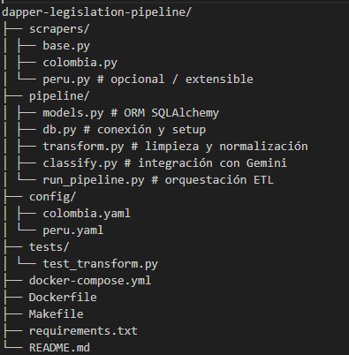
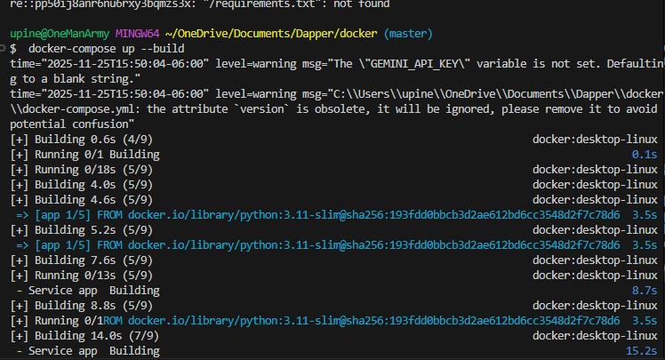
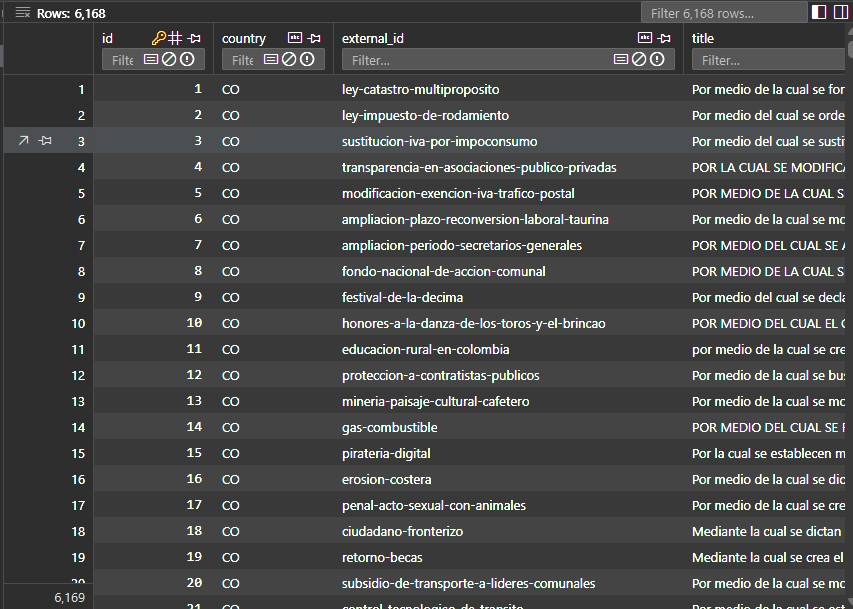
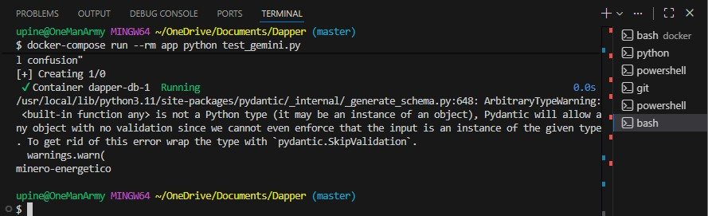

# Legislation Scraping Pipeline – Dapper Technical Challenge

Este proyecto implementa un pipeline modular, resiliente y escalable para extraer, transformar, clasificar y almacenar información de proyectos de ley publicados en portales oficiales de América Latina.
La solución está diseñada para ser fácilmente extendible a nuevos países y nuevas fuentes.

## Objetivo del Proyecto

Construir un sistema completo de scraping + limpieza + enriquecimiento + almacenamiento, capaz de procesar proyectos de ley desde múltiples fuentes públicas y clasificarlos automáticamente en sectores económicos utilizando la API de Gemini.

## Arquitectura General

El pipeline sigue una arquitectura ETL clara:

Scraper (Extract)
↓
Transform (cleaning & normalization)
↓
Gemini Classification (enrich)
↓
Database Loader (PostgreSQL, incremental)

### Componentes principales:

Scrapers modulares: cada país tiene su propio scraper basado en una clase abstracta.

Transform: parsing de fechas, normalización, estructura interna de datos.

Gemini (LLM): clasificación del proyecto por sector económico.

Loader: escritura incremental en base relacional (PostgreSQL).

Docker: correr todo el proyecto mediante docker-compose.

Tests unitarios: verificación mínima de funciones críticas.

Config YAML: valores específicos por país.

### Estructura del Proyecto

### Países Soportados

- Colombia
- Perú

La arquitectura facilita añadir más países simplemente implementando una nueva clase que herede de BaseScraper.

## Detalles Técnicos

1. **_Scraping_**

Los scrapers implementan:

    - ID externo

    - Título

    - Fecha de radicación

    - Resumen / exposición de motivos

    - Enlaces a PDFs

    - Estado actual

2. **_Transformación_**

El archivo transform.py limpia textos, convierte fechas y deja los campos listos para el modelo.

3. **_Clasificación vía Gemini_**

Usamos el SDK oficial de Google GenAI:

    - Modelo usado: gemini-2.5-flash

    - Entrada: título + resumen

    - Salida: un sector económico

Sectores soportados:

-minero-energetico

-servicios

-tecnologia

-agricultura

-financiero

-infraestructura

-salud

-educacion

-otros

La clasificación por sectores económicos usa Gemini. Debido a la cuota de la Free Tier, se implementó un mecanismo de retry + fallback que garantiza que el pipeline sea resiliente y no falle. Si la cuota se agota, automáticamente etiqueta como 'otros'.

4. **_Base de Datos_**

Modelo SQLAlchemy con constraint único:

(country, external_id)

Esto permite un pipeline incremental que evita duplicados.

## Ejecución

**_Ejecución con Docker_**

1. Clonar el repositorio
   git clone https://github.com/uriel/dapper-legislation-pipeline
   cd dapper-legislation-pipeline

2. Crear tu key de Gemini
   export GEMINI_API_KEY="TU_API_KEY"

3. Levantar todo con Docker
   docker-compose up --build
   

El contenedor app correrá automáticamente el pipeline.

**_Ejecución Local sin Docker_**

Requisitos: Python 3.10+

1. Instalar dependencias
   cd docker
   pip install -r requirements.txt

2. Iniciar base de datos (si usas Postgres local)

Asegúrate de actualizar la URL de conexión en pipeline/db.py.

3. Cambia el Gemini Gen Key
   cambiar el string GEN_API en classify.py

4. Ejecutar el pipeline
   python -m pipeline.run_pipeline

**_Salida Esperada_**

Después de correr el pipeline:

La base de datos tendrá una tabla bills

Cada registro incluirá:

| Campo                         | Descripción                                                  |
| ----------------------------- | ------------------------------------------------------------ |
| **País**                      | País de origen del proyecto de ley (CO, PE, etc.).           |
| **ID externo**                | Identificador único provisto por el portal oficial.          |
| **Título**                    | Título completo del proyecto de ley.                         |
| **Fecha**                     | Fecha de radicación o publicación.                           |
| **Resumen**                   | Descripción corta o exposición de motivos.                   |
| **PDFs**                      | Lista de URLs hacia documentos PDF asociados.                |
| **Estado**                    | Estado actual del proyecto de ley en el proceso legislativo. |
| **Sector económico (Gemini)** | Clasificación automática generada por Gemini.                |
| **Timestamps**                | Tiempos de creación y actualización en la base de datos.     |

### Testing

**_Tests Unitarios_**

Tests se incluye en:

test_transform.py

Prueba la ejecución de la transformación.

test_gemini.py
Prueba Gemini con free trial.

Para ejecutar:

pytest

## Adicionales

**_Cómo agregar un nuevo país_**

1. Crear scrapers/<pais>.py.

2. Heredar de BaseScraper.

3. Implementar fetch_bills().

4. Agregar config YAML.

5. Agregar comando en run_pipeline.py.

Gracias a la arquitectura modular, no es necesario modificar el resto del sistema.

## Notas Finales

El proyecto cumple con resiliencia, modularidad y mantenibilidad.

El pipeline puede escalar a Airflow fácilmente (las etapas ya están separadas).

Incluye manejo básico de errores, logging y reintentos.
